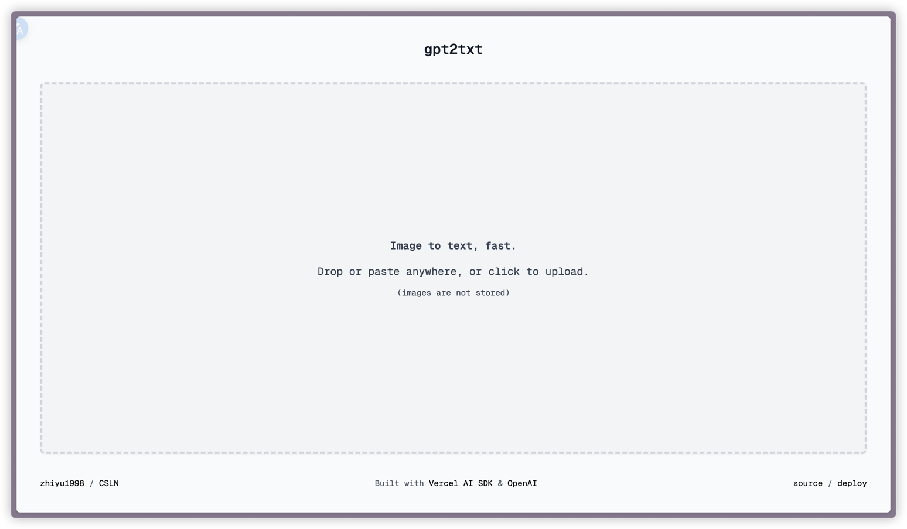

# gpt2txt

English | [中文](./README-CN.md)

Image to text using gpt, fast. Built with the [Vercel AI SDK](https://sdk.vercel.ai), [Claude](https://claude.ai/), and [Next.js](https://nextjs.org).

## Developing

-   Clone the repository
-   Create a `.env.local` file with `OPENAI_API_KEY=your-api-key` 、 `OPENAI_BASE_URL=your-base-url` and `OPENAI_MODEL=your-like-model` where `your-api-key` is your OpenAI API key from [OpenAI Platform](https://platform.openai.com/api-keys).
-   Run `yarn` to install dependencies.
-   Run `yarn dev` to start the development server.

## Acknowledgments

Thanks to the 2txt framework created by ai-ng, I created gpt2txt because it was not convenient for me to purchase Claude's API:

- [2txt: Image to text, fast.](https://github.com/ai-ng/2txt)